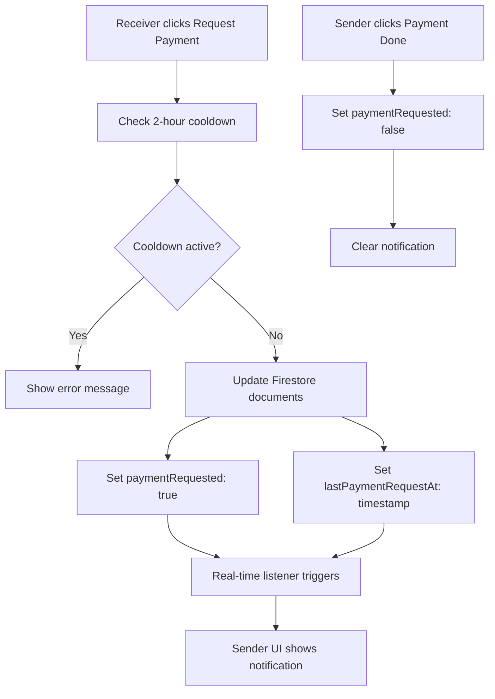

# Design Document

## Overview

The Payment Request feature enhances the existing MLM application by adding a communication mechanism between receivers and senders to expedite payment processing. The feature integrates seamlessly with the current help flow system, adding new UI components, real-time notifications, and proper security controls while maintaining all existing business logic.

The design leverages the existing Firebase/Firestore architecture, React components, and help status system. It introduces minimal changes to the codebase while providing significant value to users by reducing payment delays and improving transaction completion rates.

## Architecture

### System Integration Points

The Payment Request feature integrates with several existing systems:

1. **Help Service Layer**: Extends `helpService.js` with new payment request functions
2. **UI Components**: Enhances `ReceiveHelpRefactored.jsx` and `SendHelpRefactored.jsx` 
3. **Firestore Security**: Updates security rules for payment request field access
4. **Real-time Listeners**: Leverages existing Firebase listeners for instant updates
5. **Status System**: Works within the existing `HELP_STATUS` framework

### Data Flow Architecture



## Components and Interfaces

### Frontend Components

#### PaymentRequestButton Component
**Location**: `src/components/help/PaymentRequestButton.jsx`

**Props**:
- `helpId: string` - The help document ID
- `lastRequestTime: timestamp` - Last payment request timestamp
- `onRequestPayment: function` - Callback for payment request
- `disabled: boolean` - Button disabled state

**Features**:
- Cooldown timer display (mm:ss format)
- Disabled state when cooldown active
- Loading state during request processing
- Error handling and user feedback

#### PaymentRequestNotification Component
**Location**: `src/components/help/PaymentRequestNotification.jsx`

**Props**:
- `isVisible: boolean` - Show/hide notification
- `receiverName: string` - Name of receiver requesting payment
- `onDismiss: function` - Callback to dismiss notification

**Features**:
- Highlighted popup/card design
- Clear messaging about payment request
- Dismissible notification
- Animation for smooth appearance

### Backend Service Extensions

#### HelpService Extensions
**Location**: `src/services/helpService.js`

**New Functions**:

```javascript
// Request payment from sender (receiver action)
export async function requestPaymentFromSender(helpId)

// Check if payment request is on cooldown
export function isPaymentRequestOnCooldown(lastRequestTime)

// Get remaining cooldown time in milliseconds
export function getRemainingCooldownTime(lastRequestTime)
```

### Real-time Listeners

#### Enhanced Help Status Listener
The existing `listenToHelpStatus` function will be enhanced to monitor payment request fields:

- `paymentRequested: boolean`
- `lastPaymentRequestAt: timestamp`

#### Notification System Integration
Real-time updates will trigger UI notifications when `paymentRequested` changes from `false` to `true`.

## Data Models

### Enhanced Help Document Schema

Both `sendHelp` and `receiveHelp` documents will include these additional fields:

```javascript
{
  // Existing fields...
  status: 'assigned' | 'payment_requested' | 'payment_done' | 'confirmed',
  
  // New payment request fields
  paymentRequested: boolean,           // Default: false
  lastPaymentRequestAt: timestamp,     // Last request timestamp
  
  // Existing fields continue...
  createdAt: timestamp,
  updatedAt: timestamp
}
```

### Field Initialization Strategy

**For New Documents**: Fields are initialized during document creation
**For Existing Documents**: Fields are added on-demand with default values:
- `paymentRequested: false`
- `lastPaymentRequestAt: null`

### Data Validation Rules

1. **paymentRequested**: Must be boolean, defaults to `false`
2. **lastPaymentRequestAt**: Must be valid timestamp or `null`
3. **Cooldown Period**: 2 hours (7,200,000 milliseconds) between requests
4. **Status Constraints**: Payment requests only allowed when status is `HELP_STATUS.ASSIGNED`

## Correctness Properties

*A property is a characteristic or behavior that should hold true across all valid executions of a system-essentially, a formal statement about what the system should do. Properties serve as the bridge between human-readable specifications and machine-verifiable correctness guarantees.*

### Property 1: Button Visibility Based on Status
*For any* help item, the "Request Payment" button should be visible if and only if the help status is pending (ASSIGNED)
**Validates: Requirements 1.1, 1.2**

### Property 2: Cooldown UI State Management
*For any* help item with a recent payment request (within 2 hours), the "Request Payment" button should be disabled and show remaining time in mm:ss format
**Validates: Requirements 1.3, 1.4**

### Property 3: Document Consistency on Payment Request
*For any* successful payment request, both sendHelp and receiveHelp documents should be updated with the same timestamp and paymentRequested set to true
**Validates: Requirements 2.1, 2.2**

### Property 4: Cooldown Enforcement
*For any* payment request attempt within 2 hours of the last request, the system should block the action and display the exact message "You can request payment once every 2 hours."
**Validates: Requirements 2.3**

### Property 5: Notification Triggering
*For any* successful payment request, a notification should be triggered to the sender
**Validates: Requirements 2.4, 3.1**

### Property 6: Notification Text Accuracy
When displaying payment request notifications, the system should show the exact text "Receiver has requested you to complete the payment."
**Validates: Requirements 3.2**

### Property 7: Real-time UI Synchronization
*For any* change in paymentRequested status, all relevant user interfaces should update immediately via Firebase listeners
**Validates: Requirements 3.3, 3.4, 8.1, 8.2**

### Property 8: Schema Field Consistency
*For any* help document access, both paymentRequested and lastPaymentRequestAt fields should exist with appropriate default values if missing
**Validates: Requirements 4.1, 4.2, 4.3, 4.4**

### Property 9: Payment Completion State Reset
*For any* payment completion action, paymentRequested should be automatically set to false and notifications should be cleared
**Validates: Requirements 5.1, 5.2**

### Property 10: Status Transition Integrity
*For any* payment completion, the help document status should transition appropriately while maintaining existing MLM business logic
**Validates: Requirements 5.4**

### Property 11: Security Access Control
*For any* attempt to update payment request fields, only receivers should be allowed to update paymentRequested and lastPaymentRequestAt on their own help documents
**Validates: Requirements 6.1, 6.2, 6.3**

### Property 12: UI Consistency Preservation
*For any* payment request component rendering, the styling should match existing Send Help and Receive Help component patterns
**Validates: Requirements 7.1**

### Property 13: User Interaction Feedback
*For any* user interaction with payment request features, appropriate visual feedback and state management should be provided
**Validates: Requirements 7.4**

### Property 14: Offline Resilience
*For any* network connectivity issue, the system should handle offline scenarios gracefully and synchronize when connection is restored
**Validates: Requirements 8.4**

<function_calls>
<invoke name="prework">
<parameter name="featureName">payment-request-feature

## Error Handling

### Client-Side Error Handling

#### Cooldown Violations
- **Error**: Payment request attempted within 2-hour cooldown
- **Response**: Display toast message with remaining time
- **Recovery**: Button remains disabled until cooldown expires

#### Network Failures
- **Error**: Firebase request fails due to network issues
- **Response**: Display retry option with exponential backoff
- **Recovery**: Automatic retry with user feedback

#### Permission Denied
- **Error**: User attempts unauthorized field updates
- **Response**: Display "Permission denied" message
- **Recovery**: Redirect to appropriate help section

### Server-Side Error Handling

#### Document Synchronization Failures
- **Error**: sendHelp and receiveHelp documents become out of sync
- **Response**: Cloud Function detects and corrects inconsistencies
- **Recovery**: Automatic reconciliation with audit logging

#### Invalid Status Transitions
- **Error**: Payment request attempted on non-pending help
- **Response**: Reject request with appropriate error message
- **Recovery**: UI refreshes to show current status

### Error Recovery Patterns

1. **Optimistic Updates**: UI updates immediately, rolls back on failure
2. **Retry Logic**: Exponential backoff for transient failures
3. **Graceful Degradation**: Core functionality remains available during partial failures
4. **User Feedback**: Clear error messages with actionable guidance

## Testing Strategy

### Dual Testing Approach

The testing strategy employs both unit tests and property-based tests to ensure comprehensive coverage:

**Unit Tests**: Focus on specific examples, edge cases, and integration points
- Component rendering with different help statuses
- Cooldown timer calculations and formatting
- Error message display and handling
- Firebase security rule validation
- Integration between components

**Property-Based Tests**: Verify universal properties across all inputs using fast-check library
- Generate random help documents and verify button visibility rules
- Generate random timestamps and verify cooldown logic
- Generate random user permissions and verify security constraints
- Test real-time synchronization across multiple user sessions

### Property-Based Testing Configuration

- **Library**: fast-check for JavaScript/React property-based testing
- **Iterations**: Minimum 100 iterations per property test
- **Test Tags**: Each property test references its design document property
- **Tag Format**: `Feature: payment-request-feature, Property {number}: {property_text}`

### Test Coverage Areas

#### Frontend Testing
1. **Component Tests**: PaymentRequestButton, PaymentRequestNotification
2. **Integration Tests**: ReceiveHelp and SendHelp component integration
3. **Real-time Tests**: Firebase listener behavior and UI updates
4. **Security Tests**: Firestore rule enforcement

#### Backend Testing
1. **Service Tests**: helpService.js payment request functions
2. **Database Tests**: Document schema and field initialization
3. **Security Tests**: Firestore security rule validation
4. **Performance Tests**: Real-time listener efficiency

#### End-to-End Testing
1. **User Flow Tests**: Complete payment request workflow
2. **Multi-user Tests**: Sender and receiver interaction scenarios
3. **Error Scenario Tests**: Network failures and recovery
4. **Cooldown Tests**: Time-based restriction enforcement

### Testing Tools and Framework

- **Unit Testing**: Jest + React Testing Library
- **Property Testing**: fast-check
- **Integration Testing**: Firebase Test SDK
- **E2E Testing**: Cypress or Playwright
- **Performance Testing**: Firebase Performance Monitoring

Each correctness property will be implemented as a property-based test with the following structure:

```javascript
// Example property test
test('Feature: payment-request-feature, Property 1: Button Visibility Based on Status', () => {
  fc.assert(fc.property(
    fc.record({
      status: fc.constantFrom('assigned', 'payment_requested', 'payment_done', 'confirmed'),
      // ... other help item properties
    }),
    (helpItem) => {
      const component = render(<PaymentRequestButton helpItem={helpItem} />);
      const button = component.queryByText('Request Payment');
      
      if (helpItem.status === 'assigned') {
        expect(button).toBeInTheDocument();
      } else {
        expect(button).not.toBeInTheDocument();
      }
    }
  ), { numRuns: 100 });
});
```

This comprehensive testing approach ensures both specific functionality works correctly (unit tests) and universal properties hold across all possible inputs (property tests).